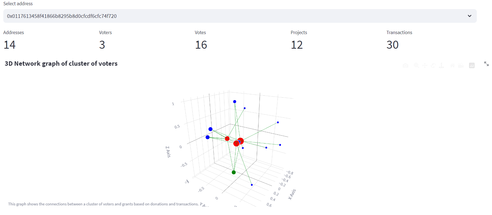

# Cluster citizen round streamlit App

This app allows to visualize clusters of voters on the basis of their donations and transactions.

## the app is deployed on streamlit
https://share.streamlit.io/poupou-web3/cluster-voters/main/app.py

## How to use
- Select the address of the voter 
- Look at the connections of the cluster

Colors:
- Red: the voters
- Green: the Round contract
- Blue: the addresses connected to the voters



## How to run the app

### On windows
```bash
git clone https://github.com/poupou-web3/cluster-voters
cd cluster-voters
python -m venv venv
venv\Scripts\activate.bat
pip install -r requirements.txt
streamlit run app.py
```


